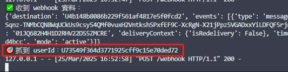
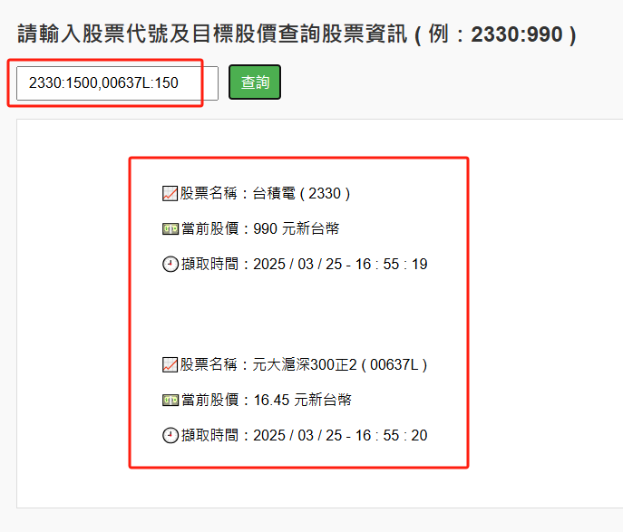

⭐股票查詢LINE通知

簡介：
這是基於interview project延伸的side project

內容的部分除了加上LINE通知之外,還將股票查詢改成了多支股票查詢

未來的方向將會是儲存使用者的ID、查詢的股票代號及目標價格

並每N分鐘爬一次,若股價低於目標價格則會透過LINE及時通知

功能使用說明:

改進interview project只能查詢一支股票的缺點
只要輸入股票及目標股價 ( 例:2330:990 )
即透過前端顯示查詢結果外
LINE也會在股價低於目標股價時馬上通知

✔️python 3.12
✔️Flask
✔️Requests
✔️BeautifulSoup
✔️json
✔️render_template
✔️HTML/JavaScript

專案結構:

```
interview_project
        ├─ app.py (主程式)
        ├─ GetStock.py (主要應用模組)
        ├─ GetStockjson.py (把模組查詢的資料存成json)
        ├─ README.md (程式簡介)
        ├─ line_bot.py (Line機器人模組)
        ├─ webhook.py (抓取Line機器人模組需要的UserID用)
        ├─ templates
        │      └─ index.html (前端首頁)
        │
        └─screenshot (畫面截圖 for README)
```

使用方法:

( Git Clone用網址 https://github.com/Frank-Pon/Interview_project2.git ) clone之後 -> 安裝所需套件 ( Flask、Requests、BeautifulSoup )
-> 在終端機輸入 python app.py -> 打開網頁輸入 127.0.0.1:5000 -> 開始查詢 ✅


抓取userID


與interview project的差異

1.可以查詢多筆,需用逗號隔開

專案學習心得:

這次新增了LINE通知及多筆查詢,遇到了不少挑戰

不只是程式碼的長度增加,還要處理外部整合 ( 像是 LINE Token、User ID 授權等 )

雖然過程中有ChatGPT的協助,但我很清楚知道我的每一段邏輯,對整個架構也越來越了解

這是我目前為止整合前後端、串接第三方服務的第一個完整作品

也讓我更有信心繼續成長

未來會加入資料儲存與排程功能，讓這套系統更實用、更完整！
